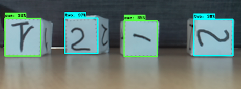

---
    Targeted learning outcomes:
    - how to organize and create the working tree to support several projects for the detection of objects in images 

    Activity type:   : ⚙️ [task]
    Expected duration: 5 minutes
---

## The multi-project work tree

The proposed generic tree structure makes it easy to develop as many Object Detection projects as you want:

	tod_tf2
	├── <project>
	│   ├── images
	│   │   ├── test
	│   │   │   └── *.jpg, *.png ... *.xml
	│   │   ├── train
	│   │   │   └── *.jpg, *.png ... *.xml
	│   │   └── *.csv
	│   │
	│   └── training
	│       ├── <pre-trained_net>
	│       ├── train.record
	│       ├── test.record
	│       └── label_map.txt
	├── pre_trained
	│	└── <pre_trained-net>
    │	
	└── models
	    └── research
	        └── object_detection
	
Each project that you work on has its own `project` directory

*  The `<project>/imges` directory contains for each project:
    * the subdirectories `test` and `train` which each contain:
        * the images PNG, JPG… to process
        * The XML annotation files created with the `labelImg` software: they give for each object the coordinates of the bounding box and the label of the object.
    * the CSV annotation files (content of XML files converted to CSV format), which in turn will be converted to _`tensorflow record`_.

* For each project the directory `<project>/training` contains:

	* `<pre_trained_net>` directory for each pre-trained network used: you can thus try several pre-trained networks to see their performances. The weight files of the network trained by you are stored in the `<pre-trained_net>` directory.
	* `train.reccord`  and `test.reccord` files: training and test labeled data in _tensorflow record_ format.
	* `l:abel_map.txt` file: lists the labels corresponding to the objects to be detected.

* The `pre-trained/` directory contains a sub-directory for each of the pre-trained networks used which stores the various files necessary for their use.
	
## Example
	
	
Let's consider the detection of hand-written digits on the faces of cubes in images given by the robot's camera:<br>


The `<project>` directory is named `cube_faces`, which gives the tree structure:

	tod_tf2
	├── cube_faces
	│   ├── images
	│   │   ├── test
	│   │   │   └── *.jpg, *.png ... *.xml
	│   │   ├── train
	│   │   │   └── *.jpg, *.png ... *.xml
	│   │   └── *.csv
	│   └── training
	│       ├── <pre-trained_net>
	│       ├── train.record
	│       ├── test.record
	│       └── label_map.txt
	├── pre-trained
	│	└── <pre-trained_net>
	└── models
	    └── research
	        └── object_detection

A few shell commands suffice to create the first levels of the tree:

```bash	
# From within tod_tf2
(tf2) user@host $ mkdir -p cube_faces/images/test
(tf2) user@host $ mkdir -p cube_faces/images/train
(tf2) user@host $ mkdir -p cube_faces/training
(tf2) user@host $ mkdir pre-trained
```
Let's check:

```bash	
# From within tod_tf2
(tf2) user@host $ tree -d . -I models  # current directory tree excluding the 'models' directory
.
├── cube_faces
│   ├── images
│   │   ├── test
│   │   └── train
│   └── training
├── pre-trained
└── tod_tf2_tools
```

