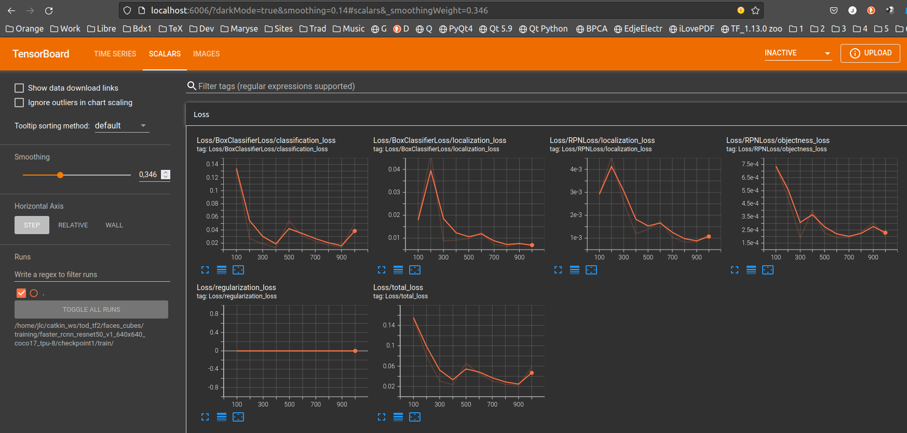

---
    Targeted learning outcomes:
    - how to customize the configuration file of a TOD pre-trained neural network.
    - how to continue the supervised training of a pre-trained TOD neural network.
    - how to export the weights of the re-trained neural network to an operational format.

    Expected duration  : 1 to 2 hours or more (depends on your computer CPU & RAM).
---

## Activity plan 

The re-train of a TOD pre-trained network involves 3 steps:

1. Customize the configuration file of the neural network to set all the parameters of the supervised training.
2. Run the supervised re-training.
3. Export the weights of the re-trained neural network to an operational format.

## Preliminaries

To simplify the shell commands that you will have to write you can define two environment variables in the file `config_tf2`:
* `PTN` (_Pre-Trained Network_) :  the name of the choosen pre-trained TOD neural network, also designated as `<pre-trained_net>`
* `PTN_DIR` : the path of the directory `<project>/training/<pre-trained_net>`

### Example

For the project `cube_faces` and the network `faster_rcnn_resnet50_v1_640x640_coco17_tpu-8` :

```bash
# From within tod_tf2
user@host $ echo 'export PTN=faster_rcnn_resnet50_v1_640x640_coco17_tpu-8' >> config_tf2
user@host $ echo 'export PTN_DIR=faces_cubes/training/$PTN' >> config_tf2
```
then after sourcing `config_tf2`, you can check that the variables are correctly defined:

```bash
user@host $ source config_tf2
user@host $ env | grep PTN      # to check
PTN_DIR=faces_cubes/training/faster_rcnn_resnet50_v1_640x640_coco17_tpu-8
PTN=faster_rcnn_resnet50_v1_640x640_coco17_tpu-8
```
## 1. Modify the configuration file

The configuration file `pipeline.config` must be copied from the directory `pre-trained/<pre-trained_net>` to the target directory `<project>/training/<pre-trained_net>`.

Using the environment variables set previously:
```bash
# From within tod_tf2
user@host $ cp pre-trained/$PTN/pipeline.config $PTN_DIR
```


* Then you must edit the file `<project>/training/<pre-trained_net>/pipeline.config` to  customize some important parameters.

### Example

With the project `cube_faces` and the pre-trained network `faster_rcnn_resnet50_v1_640x640_coco17_tpu-8`:

|Line | Parameter name              | Description                                                            | Initial value  | Value |  Comment               |
|:--|:------------------------------|:-----------------------------------------------------------------------|:----------------:|:---------------:|:--------------------------------|
|010| `num_classes`                 | number of objects classes                                              | 90               | 2               | the two classe `one` et `two` |
|077| `max_detections_per_class`    | maximum number of detections per classe                                | 100              | 4               | 4 cubes maximum per image | 
|078| `max_total_detections`        | total maximum number of detections                                     | 100              | 4               | 4 `one` or `two` on the 4 cubes | 
|093| `batch_size`                  | number of images per batch to learn before updating the network weights| 64               | 1, 2...       | a high value can result in RAM overhead. To be adjusted according to the amount of your computer RAM|
|097| `num_steps`                   | Max number of iterations steps                                         | 25000            | 1000           | a too great value can result in very high computing times and also an over-fiitting risk| 
|113| `fine_tune_checkpoint`        | path of the output files to save the network weights                   | 'PATH_TO_BE_CONFIGURED' | 'pre-trained/faster_rcnn_resnet50_v1_640x640_coco17_tpu-8/checkpoint/ckpt-0' | the path ends with `/ckpt-0`which is the prefix of the files in the directory `.../checkpoint/` |
|114| `fine_tune_checkpoint_type`   | Which algorithm to use: "classification" or "detection"                | 'classification' | 'detection'  | you to train the TOD pre-trained network to Object Detction|
|120| `max_number_of_boxes`         | Maximum number of bounding boxes in every image                        | 100               | 4               | the 4 bounding boxes around the visible face of the 4 cubes|
|122| `use_bfloat16`                | `true` for TPA architectures, `false` for CPU                          | true              | false           |  depnds on your computer: for a laptop it is a CPU|
|126| `label_map_path`              | path of the label file                                                 | 'PATH_TO_BE_CONFIGURED' | 'cube_faces/training/label_map.pbtxt' | used for training stage |
|128| `input_path`                  | path of the input file for training used for evaluation stage          | 'PATH_TO_BE_CONFIGURED' | 'cube_faces/training/train.record'    | used for training stage |
|139| `label_map_path`              | path of the label file                                                 | 'PATH_TO_BE_CONFIGURED' | 'cube_faces/training/label_map.pbtxt' | used for evaluation stage|
|143| `input_path`                  | path of the input file for training used for evaluation stage          | 'PATH_TO_BE_CONFIGURED' | 'cube_faces/training/test.record"    | used for evaluation stage|


## 2 Launch the re-training

⚠️ It is important to verify carefully the content of the file `<project>/training/<pre-trained_net>/pipeline.configure` before lauching the training: a good practice is to have it checked by someone else...

⚠️ Don't use values of `batch_size`>=2 unless your computer has a powerful CPU and at least 6 GB of RAM !<br>
For example on a laptop with a processor Intel core i7 and 8 Gio RAM, with `num_steps=1000`  :
* `batch_size=1` : the calculation takes about 1h30 (~5.7 sec per step) and up to ~4 GiB RAM
* `batch_size=2` : the calculation takes about 3h (~11 sec per step) and up to ~4.5 GiO RAM 
* `batch_size=4` : the calculation takes about 6h (~22 sec per step) and up to ~6 GiO RAM.

Copy the file `models/research/object_detection/model_main_tf2.py` in the root directory `tod_tf2`:
```bash
# From within tod_tf2
(tf2) user@host $ cp models/research/object_detection/model_main_tf2.py .
```
Then launch the training:
```bash
# From within tod_tf2
(tf2) user@host $ python model_main_tf2.py --model_dir=$PTN_DIR/checkpoint1 --pipeline_config_path=$PTN_DIR/pipeline.config
```
The trained weights of the network are written in the directory `$PTN_DIR/checkpoint1` : if you launch again another training you can use `checkpoint2`, `checkpoint3`... to separate the results for successive trials.

The _tensorflow_ module is quite verbose...<br>
After a "certain time" (which can be quite long, several tens of minutes with an ordinary CPU), the logs are displayed on the screen, in particular the lines which start with `INFO` showing that the training is in progress:

	...
	...
    INFO:tensorflow:Step 100 per-step time 11.094s
    I0123 17:51:15.919782 140056729301632 model_lib_v2.py:705] Step 100 per-step time 11.094s
    INFO:tensorflow:{'Loss/BoxClassifierLoss/classification_loss': 0.13388917,
     'Loss/BoxClassifierLoss/localization_loss': 0.017869305,
     'Loss/RPNLoss/localization_loss': 0.0029150385,
     'Loss/RPNLoss/objectness_loss': 0.0007381027,
     'Loss/regularization_loss': 0.0,
     'Loss/total_loss': 0.15541162,
     'learning_rate': 0.014666351}
    I0123 17:51:15.920520 140056729301632 model_lib_v2.py:708] {'Loss/BoxClassifierLoss/classification_loss': 0.13388917,
     'Loss/BoxClassifierLoss/localization_loss': 0.017869305,
     'Loss/RPNLoss/localization_loss': 0.0029150385,
     'Loss/RPNLoss/objectness_loss': 0.0007381027,
     'Loss/regularization_loss': 0.0,
     'Loss/total_loss': 0.15541162,
     'learning_rate': 0.014666351}
    ...
    INFO:tensorflow:Step 1000 per-step time 10.638s
    I0123 20:30:50.425828 140056729301632 model_lib_v2.py:705] Step 1000 per-step time 10.638s
    INFO:tensorflow:{'Loss/BoxClassifierLoss/classification_loss': 0.05049885,
     'Loss/BoxClassifierLoss/localization_loss': 0.0066467496,
     'Loss/RPNLoss/localization_loss': 0.0011727745,
     'Loss/RPNLoss/objectness_loss': 0.0002043869,
     'Loss/regularization_loss': 0.0,
     'Loss/total_loss': 0.05852276,
     'learning_rate': 0.0266665}
    I0123 20:30:50.426177 140056729301632 model_lib_v2.py:708] {'Loss/BoxClassifierLoss/classification_loss': 0.05049885,
     'Loss/BoxClassifierLoss/localization_loss': 0.0066467496,
     'Loss/RPNLoss/localization_loss': 0.0011727745,
     'Loss/RPNLoss/objectness_loss': 0.0002043869,
     'Loss/regularization_loss': 0.0,
     'Loss/total_loss': 0.05852276,
     'learning_rate': 0.0266665}

if the process stops suddenly with the message "Process stopped", do not hesitate to reduce the value of `batch_size` down to 2, or even 1 if necessary .... <br>
Even with `batch_size=2`, the Python process may require many GiB of RAM on its own, which can put some laptops in difficulty ...

In the example above, we see logs every 100 steps, with ~10.7 seconds per step, or approximately 18 minutes between each display and ~3 hours of calculation for 1000 steps. This calculation is done with `batch_size=2` on an Intel core i7 CPU with 8 GiB RAM.

Once the training is finished you can analyze the training statistics with `tensorboard` by typing the command:
```bash
# From within tod_tf2
(tf2) user@host:~ $ tensorboard --logdir=$PTN_DIR/checkpoint1/train
Serving TensorBoard on localhost; to expose to the network, use a proxy or pass --bind_all
TensorBoard 2.11.2 at http://localhost:6006/ (Press CTRL+C to quit)
...
```
`tensorboard` launches a local HTTP server on your computer and you can load the page with a web brower to see the performance plots by hiting "CTRL + left_clic" whith the mouse cursor positionned over `http://localhost:6006/` :



_tensorboard_ lets you observe the evolution over steps of the main statistics of the learning process.

## 3. Export the weights of the trained network

Now copy the file `exporter_main_v2.py` from the directory `models/reasearch/object_detection/` to the root directory `tod_tf2`. 
When you run this script, it extracts the trained __inference graph__ and saves it as `saved_model.pb` (this file can be used later to load the trained network):
```bash
# From within tod_tf2
(tf2) user@host $ cp models/research/object_detection/exporter_main_v2.py .
(tf2) user@host $ python exporter_main_v2.py --input_type image_tensor --pipeline_config_path $PTN_DIR/pipeline.config --trained_checkpoint_dir $PTN_DIR/checkpoint1 --output_directory $PTN_DIR/saved_model1
...some stuff....
```
The Python script creates the file `saved_model.pb` under the directory `$PTN_DIR/saved_model1/saved_model`:

```bash
# From within tod_tf2
(tf2) user@host:~ $ tree cube_faces/training/
cube_faces/training/
├── faster_rcnn_resnet50_v1_640x640_coco17_tpu-8
│   ├── checkpoint1
│   │   ├── checkpoint
│   │   ├── ckpt-1.data-00000-of-00001
│   │   ├── ckpt-1.index
│   │   ├── ckpt-2.data-00000-of-00001
│   │   ├── ckpt-2.index
│   │   └── train
│   │       └── events.out.tfevents.1635373645.pikatchou.30316.0.v2
│   ├── pipeline.config
│   └── saved_model1
│       ├── checkpoint
│       │   ├── checkpoint
│       │   ├── ckpt-0.data-00000-of-00001
│       │   └── ckpt-0.index
│       ├── pipeline.config
│       └── saved_model
│           ├── assets
│           ├── saved_model.pb
│           └── variables
│               ├── variables.data-00000-of-00001
│               └── variables.index
├── label_map.pbtxt
├── test.record
└── train.record

```

