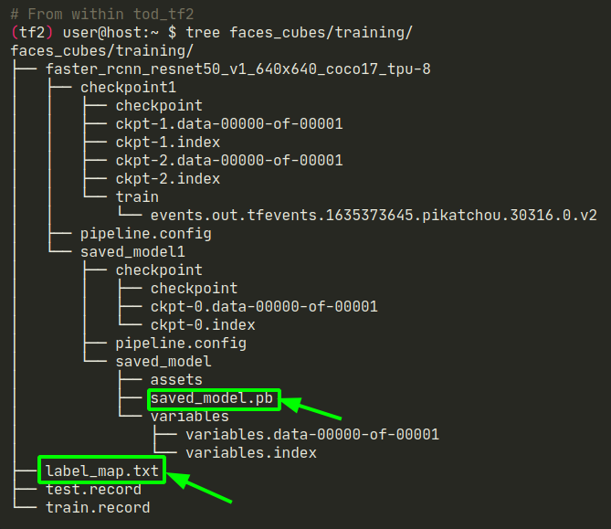
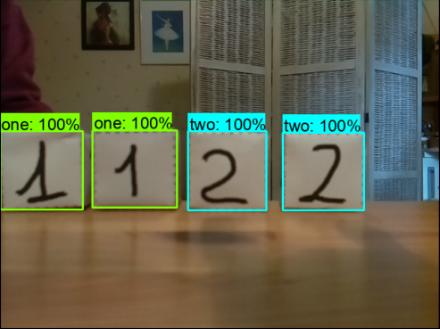

---
    Acquis d'apprentissage visés :
    - Savoir exploiter un réseau TOD ré-entraîné.

    Type d'activité     : ⚙️ [tâche]
    Durée approximative : 30 minutes (dépend des ressources CPU & RAM de ton ordinateur).
---

## Évaluer les inférences du réseau ré-entrainé

Le but de cette activité est de Vérifier que le réseau entraîné est bien capable de détecter les faces des cubes en discriminant correctement les numéros écrits sur les faces.

Le script Python `plot_object_detection_saved_model.py` permet d'exploiter le réseau de neuronnes ré-entraîné sur des images, les arguments sont :
* `-l` : le chemin du fichier `label_map.pbtxt`
* `-s` : le chemin du dossier `saved_model/` contenant les fichiers des poids du réseau ré-entraîné
* `-i` : le chemin __du dossier des images__ ou le chemin __du fichier image__ à analyser
* `-n` : le nombre max d'objets à détecter (opetionnel, valeur par défaut : 4)
* `-t` : le seuil (_threshold_) de détection exprimé en % (optionnel, valeur par défaut : 50 %).



Par exemple pour faire la détection des cubes des images de test avec le réseau que tu viens d'entraîner :

```bash
# From within tod_tf2
(tf2) user@host: $ python plot_object_detection_saved_model.py -l faces_cubes/training/label_map.pbtxt -s $PTN_DIR/saved_model1/saved_model -i faces_cubes/images/test/
Loading model...Done! Took 13.23 seconds
Running inference for faces_cubes/images/test/image016.png... [2 2 1 1]
[0.9998258  0.99902177 0.99812204 0.9964721 ]
[[0.40203822 0.12419666 0.64018315 0.30807328]
 [0.4043577  0.76715255 0.6404976  0.9653229 ]
 [0.40296176 0.5467712  0.63852876 0.7309122 ]
 [0.3932786  0.32322642 0.64034694 0.5083482 ]]
Running inference for faces_cubes/images/test/image018.png... [2 2 1 1]
[0.99967873 0.9996051  0.9983627  0.99751186]
[[0.40055594 0.6233792  0.63929296 0.80680573]
 [0.40259457 0.4026048  0.63897103 0.58319676]
 [0.4041245  0.19101582 0.6288158  0.3679664 ]
 [0.40252358 0.         0.64536196 0.16534011]]
Running inference for faces_cubes/images/test/image019.png... [2 2 1 1]
[0.99970055 0.9993857  0.99750453 0.9968694 ]
[[0.40160167 0.42744026 0.6401532  0.6097636 ]
 [0.40586317 0.64189494 0.6397717  0.82715124]
 [0.40226468 0.         0.6392519  0.18196338]
 [0.39843452 0.20977092 0.6328793  0.3960455 ]]
Running inference for faces_cubes/images/test/image017.png... [2 2 1 1]
[0.9997949 0.9994717 0.9933088 0.9883559]
[[0.40147427 0.6982088  0.63554984 0.87740797]
 [0.39989385 0.04223634 0.6387966  0.24200168]
 [0.40242052 0.4871788  0.6324738  0.66032267]
 [0.39879817 0.2852207  0.6340168  0.4698804 ]]
```

Exemples d'images produites par le script Python :

|   image016.png           |   image018.png               |            image019.png    |    image017.png
:-------------------------:|:----------------------------:|:--------------------------:|:------------------------------:
 |    |  | 

Pour chaque image traitée on a :
* la liste des 4 labels des objets trouvé (`1` ou `2`)
* la liste des 4 probabilités des objets trouvés
* la liste des 4 jeux de coordonnées normalisées des boîtes englobantes [ y, x du coin haut-gauche puis y, x du coin bas-droit]. 

⚠️ Note que les listes sont données dans __l'ordre des probabilités de détection décroissantes__ : 
* si tu veux trier les listes dans l'ordre de gauche à droite dans l'image, tu peux exploiter les abcisses `x` des boites englobantes,
* si tu veux trier les listes dans l'ordre de haut en bas dan sl'image, tu peux exploiter l'ordonnée `y` des boites englobantes.

Dans tous les cas, la fonction __numpy__ `argsort` est ton amie... (tu peux voir un exemple d'implémentation dans le fichier `plot_object_detection_sorted_saved_model.py`.)

## La suite ....

Quelques idées à bien garder en tête :

* ⚠️  l'EVP `(tf2)` doit être utilisé __UNIQUEMENT pour entraîner le réseau de neurones__.
* ⚠️  l'EVP `(tf2)` __ne doit pas être utilisé avec ROS pour exploiter__ le réseau de neurone ré-entrainé.
* ROS utilise l'__installation standard de Python__ sur ta machine, hors de tout EVP : c'est un environnement que tu gères en tapant `sudo apt install python3-...`, ou `pip3 install ...` ou encore `sudo pip3 instal ...`
* Pour instancier le réseau sauvegardé, tu vas utiliser la fonction `saved_model.load` du module _tensorflow_ (cf fichier `nn.py`) : il faudra que tu installes le module _tensorflow_ dans l'environnement Python standard de ta machine : `pip3 install tensorflow==2.9` devrait convenir ! 
* le fichier `nn.py` dans le dossier `tod_tf2` donne une base de départ pour le programme d'intégration de vendredi... <br>
Pour l'utiliser, il faudra que tu installes d'autres modules : par exemple  `pip3 install opencv-python==4.6.0.66`<br>
À chaque fois que l'exécution de `nn.py` te donnera un message d'erreur "module xxx not found" il faudra que tu tapes `pip3 install xxxx` pour ajouter le module incriminé dans l'environnement Python standard de ta machine.

