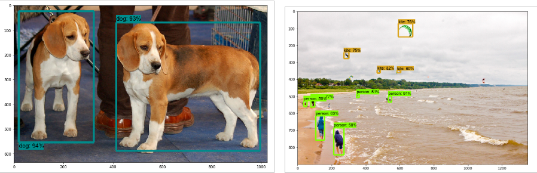

---
    Acquis d'apprentissage visés :
    - Savoir initialiser ton espace de travail pour la détection d'objets utilisant l'API TOD
    - Savoir installer l'API TOD et les composants requis

    Durée prévue    : 20 minutes + temps calcul (dépend du débit internet et des ressources CPU & RAM de ton ordinateur).
---

## Prérequis

* BAC+2 et +
* Savoir utiliser les commandes de bases Linux pour utiliser et modifier l'arborescence des fichiers.
* Bonne compréhension de Python et des tableaux multi-dimensionnels de numpy (`ndarray`).
* Première expérience des réseaux de neurones (denses et convolutionnels) souhaitable.

## Plan de l'activité 

L'installation de l'API proposée comporte 5 étapes :
1. Initialiser ton espace de travail
2. Télécharger et installer le dépôt `tensorflow/models`
3. Installer les outils `protobuf`
4. Installer le package `object_detection` 
5. Tester l'installation de l'API TOD

Dans toute la suite le _prompt_ du terminal sera noté `(tf2) user@host $` : le préfixe `(tf2)` est là pour bien rappeler que le travail d'installation de l'_API TOD_ se fait dans l'__Environnement Virtuel Python tf2__ que tu auras créé au préalable (cf les Prérequis).


### 1. Créé et initialise ton espace de travail

La première étape consiste à créer le répertoire de travail `tod_tf2`, qui sera le  __dossier racine du projet__ dans lequel seront créés tous les fichiers, et à te positionner dans ce répertoire :
```bash
(tf2) user@host $ cd <quelque_part>   # choisis le répertoire où créer `tod_tf2`, par exemple "cd ~/catkins_ws"
(tf2) user@host $ mkdir tod_tf2
(tf2) user@host $ cd tod_tf2/
```
📥 Ensuite, tu clones le dépôt github `cjlux/tod_tf2_tools.git` et tu copies les fichiers `*.py` et `*.ipynb` du dossier `tod_tf2_tools` dans le dossier `tod_tf2` : 
```bash
# From tod_tf2/
(tf2) user@host $ git clone https://github.com/cjlux/tod_tf2_tools.git
(tf2) user@host $ cp tod_tf2_tools/*.py* .
```

### 2. Télécharge et installe le dépôt `tensorflow/models`

📥 Télécharge le ZIP du dépôt github `tensorflow/models` (~ 35 Mio) dans le dossier `/tmp` puis dézippe son contenu dans le dossier `tod_tf2` :
```bash
(tf2) user@host $ wget https://github.com/tensorflow/models/archive/refs/heads/master.zip -P /tmp
(tf2) user@host $ cd ~/catkin_ws/tod_tf2       # adapte au besoin si le chemin d'accès à tod_tf2 est différent
(tf2) user@host $ unzip /tmp/master.zip        # dézipe l'archive dans le dossier tod_tf2
(tf2) user@host $ mv models-master/ models     # renomme models-master en models
(tf2) user@host $ rm /tmp/master.zip           # efface le zip dans /tmp qui ne sert plus
```

L’_API TOD_ est dans le dossier `models/research/object_detection` :
```bash	
(tf2) user@host $ tree -d models -L 2   # arbre du dossier models sur 2 niveaux
models
├── community
├── official
│   ...
├── orbit
│   ...
└── research
    ...    
    ├── object_detection
    ...
```	

Mets à jour la variable d’environnement `PYTHONPATH` en ajoutant à la fin de ton fichier `~/.bashrc` les deux lignes :
```bash
export TOD_ROOT="<chemin absolu du dossier tod_tf2>"
export PYTHONPATH=$TOD_ROOT/models:$TOD_ROOT/models/research:$PYTHONPATH
```
remplace `"<chemin absolu du dossier tod_tf2>"` par le chemin absolu du dossier `tod_tf2` 
sur ta machine (par exmple : `/home/<logname>/catkin_ws/todtf2`).

* Lance un nouveau terminal pour activer le nouvel environnement shell : tout ce qui suit sera fait dans ce nouveau terminal.

* ⚠️ n'oublie pas d'activer l'EVP `tf2` dans ce nouveau terminal :
```bash
user@host $ conda activate tf2
(tf2) user@host $
 ```

### 3. Installe les outils `protobuf`

L’_API_ native _TOD_ utilise des fichiers `*.proto` pour la configuration des modèles et le stockage des paramètres d’entraînement. 
Ces fichiers doivent être traduits en fichiers `*.py` afin que l’_API_ Python puisse fonctionner correctement : 

* Installe d'abord le paquet debian `protobuf-compile` qui donne accès à la commande `protoc` :
```bash
(tf2) user@host $ sudo apt install protobuf-compiler
```
* Tu peux ensuite te positionner dans le dossier `tod_tf2/models/research` et taper :
```bash
# From tod_tf2
(tf2) user@host $ cd models/research/
(tf2) user@host $ protoc object_detection/protos/*.proto  --python_out=.
```
Cette commande travaille de façon muette.

### 4. Installe le module `object_detection` 

Pour finir l'installation, place-toi dans le dossier  `models/research/` et installe l'API TOD :
```bash
(tf2) user@host $ cd ~/catkin_ws/tod_tf2       # adapte au besoin si le chemin d'accès à tod_tf2 est différent
(tf2) user@host $ cd models/research/
# From tod_tf2/models/research/
(tf2) user@host $ cp object_detection/packages/tf2/setup.py .
(tf2) user@host $ python setup.py build
(tf2) user@host $ pip install .
```

### 5. Teste l'installation de l'API TOD

Pour tester ton installation de l’API TOD, place-toi dans le dossier `models/research/` et tape la commande :
```bash	
# From within tod_tf2/models/research/
(tf2) user@host $ python object_detection/builders/model_builder_tf2_test.py
```
Le programme déroule toute une série de tests qui peuvent durer "un certain temsp..." et doit se terminer par un OK sans faire apparaître d'erreur :

	...
    [       OK ] ModelBuilderTF2Test.test_invalid_second_stage_batch_size
    [ RUN      ] ModelBuilderTF2Test.test_session
    [  SKIPPED ] ModelBuilderTF2Test.test_session
    [ RUN      ] ModelBuilderTF2Test.test_unknown_faster_rcnn_feature_extractor
    INFO:tensorflow:time(__main__.ModelBuilderTF2Test.test_unknown_faster_rcnn_feature_extractor): 0.0s
    I0123 08:34:37.337631 140223845503616 test_util.py:2457] time(__main__.ModelBuilderTF2Test.test_unknown_faster_rcnn_feature_extractor): 0.0s
    [       OK ] ModelBuilderTF2Test.test_unknown_faster_rcnn_feature_extractor
    [ RUN      ] ModelBuilderTF2Test.test_unknown_meta_architecture
    INFO:tensorflow:time(__main__.ModelBuilderTF2Test.test_unknown_meta_architecture): 0.0s
    I0123 08:34:37.338212 140223845503616 test_util.py:2457] time(__main__.ModelBuilderTF2Test.test_unknown_meta_architecture): 0.0s
    [       OK ] ModelBuilderTF2Test.test_unknown_meta_architecture
    [ RUN      ] ModelBuilderTF2Test.test_unknown_ssd_feature_extractor
    INFO:tensorflow:time(__main__.ModelBuilderTF2Test.test_unknown_ssd_feature_extractor): 0.0s
    I0123 08:34:37.339969 140223845503616 test_util.py:2457] time(__main__.ModelBuilderTF2Test.test_unknown_ssd_feature_extractor): 0.0s
    [       OK ] ModelBuilderTF2Test.test_unknown_ssd_feature_extractor
    ----------------------------------------------------------------------
    Ran 24 tests in 30.259s

    OK (skipped=1)

__L'absence de message d'erreur valide l'installation de l'_API TOD_ sur ta machine.__

## Compléments...

Pour finir, tu peux vérifier l’installation de l'_API TOD_en utilisant le notebook IPython `object_detection_tutorial.ipynb` présent dans le dossier `tod_tf2`.<br>
(note : c'est une copie du notebook original `tod_tf2/models/research/object_detection/colab_tutorials/object_detection_tutorial.ipynb` dans lequelle on a enlevé les cellules d'installation de l'_API_TOD_ et quelques autres cellules qui peuvent générer des erreurs...).

* Dans le dossier `tod_tf2` lance la commande `jupyter lab` (ou `jupyter notebook`) et charge le notebook `object_detection_tutorial.ipynb`.
* Exécute les cellules une à une, tu ne dois pas avoir d’erreur :

	* La partie "__Detection__" (qui dure de quelques secondes à plusieurs minutes suivant ton CPU) utilise le réseau pré-entraîné `ssd_mobilenet_v1_coco_2017_11_17` pour détecter des objets dans deux images de test :<br>



