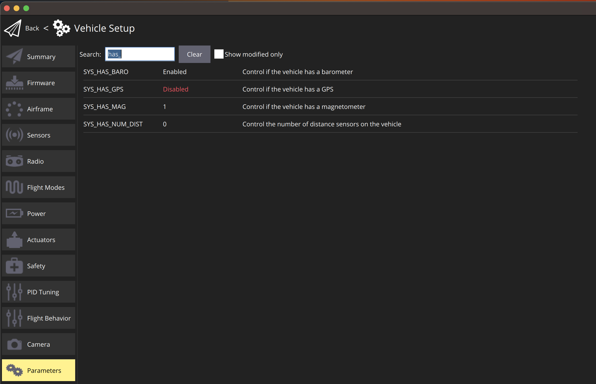
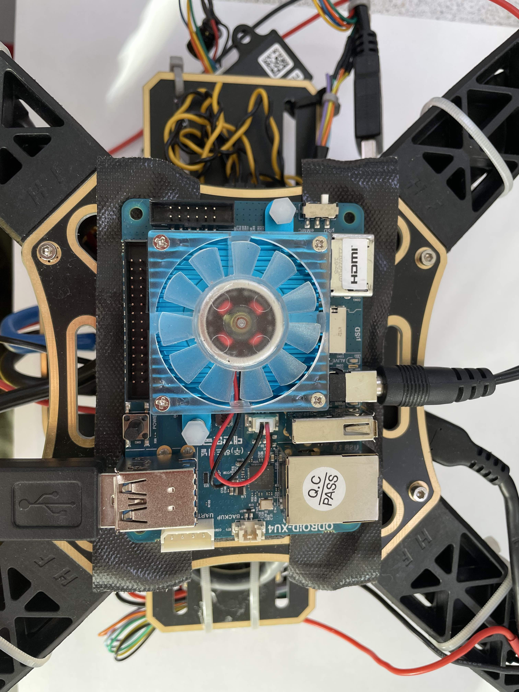
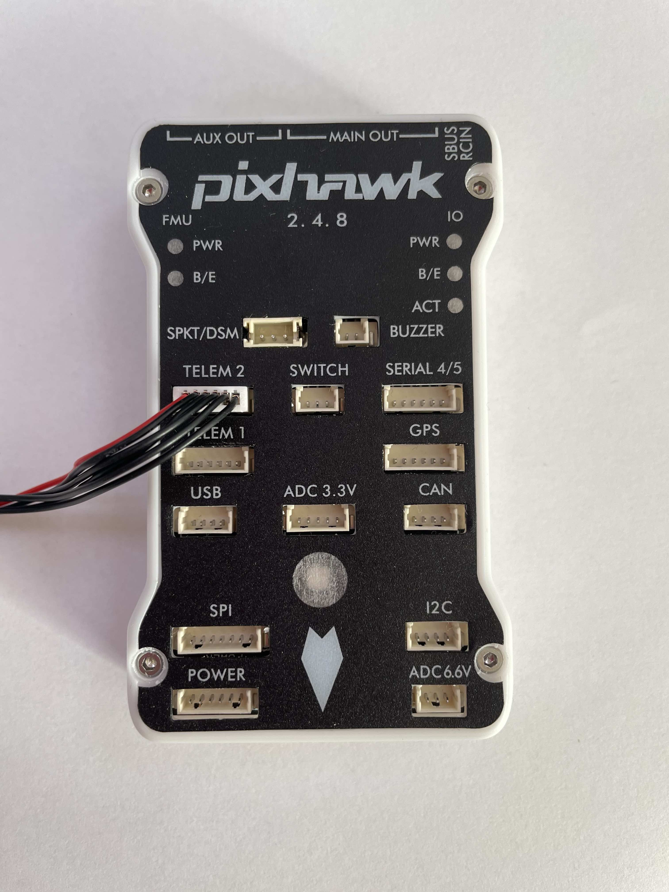

## Prérequis

* Lycée et +
* Notions de Python et commandes dans un terminal
* Clef USB bootable avec l'environnement ROS

## Diapositives



## Quelques alias
Les alias sont des racourcis qui nous permettent d'éxectuer des commandes recurentes plus rapidement. 

```bash
alias sb="source ~/.bashrc"
```

## Travaux pratiques

**Vous devez utiliser la clef USB bootable fournit pour la formation.**

## A. Simulation
Pour mieux comprendre comment fonctionne l'assemblage ROS & drone, nous allons dans un premier temps essayer de faire voler un drone dans un environnement de simulation. Cet environnement de simulation permet de tester nos package ROS sans avoir de perte ou de casse de matériel. Une fois les essais concluants en simulation vous pourrez passer sur un drone bien réel.
Dans un premier temps, il vous ai demandé de mettre en place l'environnement de simulation et de réussir à faire décoler le drone à environ 2m de hauteur et rester statique. Ensuite, nous ajouterons un package qui permet de simuler un système de MOtion CAPture (MOCAP). Une fois ce package ajouté, nous allons désactiver le GPS du drone et vérifier que ce dernier peut toujours décoller normalement. Enfin, nous ajouterons un package qui permet de faire de l'avoidance. Ce package se base sur l'ajout de différent capteurs sur le drone. La partie pratique de l'avoidance est donc en bonus.

### 1. Installer ROS
Avant de pouvoir commencer, nous devons mettre en place notre environnement de développement ROS. Nous allons donc installer ROS dans sa version `noetic` ainsi que Gazebo et Rviz. Gazebo est un logiciel de simulation d'environnement. C'est dans ce logiciel que nous pourrons voir notre drone évoluer lors des différentes simulations. Rviz est un logiciel d'analyse qui nous permet de debuguer notre système lors des simulations.
Dans un premier temps, nous allons installer tous les paquets requis pour faire voler un drone en intérieur et le simuler. Pour ce faire, il vous faut ouvrir [ce fichier](https://github.com/aiRCS-Lab/scripts/blob/main/install_ros_noetic_rpy_ubuntu_focal.sh) et executer les commandes.

Une fois l'installation de ROS terminée, nous pouvons vérifier notre travail avec la commande suivante :
```bash
source /opt/ros/noetic/setup.bash
```

Afin de se faciliter le travail et d'avoir à taper cette commande tout le temps, nous pouvons l'ajouter à notre fichier `~/.bashrc` :

```bash
echo "source /opt/ros/noetic/setup.bash" >> ~/.bashrc
source ~/.bashrc # $ sb
```

Vous pouvez remarquer que la commande ci-dessus est la même commande que nous vons configurée en alias précédemment. Un simple `sb` dans le terminal permet de remplacer la commande `setup.bash`.

Maintenant que nous avons installer le coeur de ROS, nous pouons installer ses dépendances. Ces dernières vont nous permettre de créer et gérer notre environnement de développement. Pour les installer, tapez la commande suivante.

```bash
sudo apt install python3-rosdep python3-rosinstall python3-rosinstall-generator python3-wstool build-essential
```

Il est alors possible d'initialiser `rosdep` avec les commandes suivantes :

```bash
sudo rosdep init
rosdep update
```

Une fois ceci fait, nous allons installer les paquets qui permettent de créer la `workspace` :

```bash
sudo apt install ros-noetic-catkin python3-catkin-tools -y
sudo ln -s /usr/bin/python3 /usr/bin/python
```

Nous allons maintenant pouvoir installer un emulateur pour le controleur de vol du drone.

### 2. Installer PX4
Maintenant que nous avons un environnement ROS opérationnel, nous devons télécharger le firmware PX4 qui possède des outils permettant de simuler entièrement le controleur de vol (Pixhawk). Ainsi, nous pourrons avoir les mêmes interfaces de pilotage que dans la réalité.

Pour pouvoir compiler le firmware vous devez installer les paquets du script [ici](https://github.com/aiRCS-Lab/scripts/blob/main/install_ros_noetic_rpy_ubuntu_focal.sh).

Dans un premier temps, nous devons récupérer le repertoire sur Github et ensuite nous devons le compiler :

```bash
cd ~

git clone -b v1.13.2 https://github.com/PX4/PX4-Autopilot.git --recursive /home/$USER/PX4-Firmware/

echo 'source ~/PX4-Firmware/Tools/setup_gazebo.bash ~/PX4-Firmware ~/PX4-Firmware/build/px4_sitl_default' >> /home/$USER/.bashrc
echo 'export ROS_PACKAGE_PATH=$ROS_PACKAGE_PATH:~/PX4-Firmware' >> /home/$USER/.bashrc
echo 'export ROS_PACKAGE_PATH=$ROS_PACKAGE_PATH:~/PX4-Firmware/Tools/sitl_gazebo' >> /home/$USER/.bashrc
echo 'export GAZEBO_PLUGIN_PATH=$GAZEBO_PLUGIN_PATH:/usr/lib/x86_64-linux-gnu/gazebo-9/plugins' >> /home/$USER/.bashrc

source ~/.bashrc

cd ~/PX4-Firmware
make px4_sitl_default gazebo
```

Une fois la dernière commande lancée, la compilation du firmware va démarrer. Une fois cette dernière terminée, une simulation de décollage va commencer. Vous pouvez regarder le resultat de la simulation dans la fenêtre de Gazebo.

Vous pouvez alors télécharger et lancer QGroundControl qui est le logiciel qui permet de communiquer avec le drone :

```bash
sudo usermod -a -G dialout $USER
sudo apt-get remove modemmanager -y
sudo apt install gstreamer1.0-plugins-bad gstreamer1.0-libav gstreamer1.0-gl -y
sudo apt install libqt5gui5 -y
sudo apt install libfuse2 -y

wget https://d176tv9ibo4jno.cloudfront.net/latest/QGroundControl.AppImage
chmod +x ./QGroundControl.AppImage
./QGroundControl.AppImage
```

Une fois ce dernier lancé, il va automatiquement détecter le drone dans la simulation et se connecter.

Vous pouvez maintenant fermer la simulation en tapant `Ctrl+C` dans le terminal où vous avez lancé la simulation. Nous allons maintenant comment lier la simulation du firmware et ROS. 

### 3. "Offboard Flight Mode"
Les choses sérieuses peuvent commencer ... Notre environnement de développement est enfin opérationel. Nous allons maintenant créer une workspace qui va accueillir les différents packages ROS dont nous avons besoin et ceux que nous allons créer.

Pour créer la workspace, nous devons dabord créer un dossier et ensuite dire à ROS d'initialisé la workspace :

```bash
mkdir -p ~/mocapfly_ws/src
cd ~/mocapfly_ws
catkin init
wstool init src
```

Ensuite, on installe MAVLink. MAVLink est un paquet qui permet de communiquer entre le drone et le companion computer. Plus précisemment, il va permettre de décoder les messages envoyer par le drone et de coder les messages de ROS afin qu'ils soient compréhensible par le drone.

```bash
rosinstall_generator --rosdistro noetic mavlink | tee /tmp/mavros.rosinstall
```

Puis, MAVROS. Dans la continuité de MAVLink, MAVROS à la charge la connexion entre le drone et le companion computer.

```bash
rosinstall_generator --rosdistro noetic --upstream mavros | tee -a /tmp/mavros.rosinstall
```

On merge la WS puis on installe les packages :

```bash
wstool merge -t src /tmp/mavros.rosinstall
wstool update -t src -j4
rosdep update
rosdep install --from-paths src --ignore-src -y --rosdistro noetic
```

Nous pouvons maintenant build la WS avec catkin :

```bash
catkin build
```

Ensuite, on charge les outils de la WS :

```bash
source devel/setup.bash
```

Nous allons maintenant créer notre premier package qui permet de passer le FCU en mode OFFBOARD. Ceci, permettra à ROS de devenir le "pilote" du FCU. Nous pourrons donc créer des missions grâce à ROS.

> Il est important de comprendre qu'ici ROS n'est pas le pilote du drone mais le donneur d'ordre sur la destination où aller. Pour vulgariser : Quand vous commandez un Uber c'est  à vous de dire au chauffeur où vous souhaitez aller, et il se débrouille pour vous y emmener.
> Dans cet exemple, ROS c'est vous et le chauffeur Uber est le FCU.

On se rend dans la WS :

```bash
roscd  # Should cd into ~/mocapfly_ws/devel
cd .. 
cd src
```

On créé le nouveau package :

```bash
catkin_create_pkg offboard_py rospy
```

Ensuite, on rebuild la WS, on recharge les outils et nous pouvont commencer à coder :

```bash
cd .. # Assuming previous directory to be ~/mocapfly_ws/src
catkin build
source ../devel/setup.bash
```

On se rend dans le dossier du package et ensuite on créé un dossier pour stocker notre package : 

```bash
roscd offboard_py
mkdir scripts
cd scripts
```

Dans un premier temps on créé le fichier du controller et on le rend executable :

```bash
touch offb_node.py
chmod +x offb_node.py
```

Ensuite, on utilise le code suivant pour permettre le passage en mode OFFBOARD :

```bash
vim offb_node.py # you may use $ code . 
```

Le code :

```python
#! /usr/bin/env python3

import rospy
from geometry_msgs.msg import PoseStamped
from mavros_msgs.msg import State
from mavros_msgs.srv import CommandBool, CommandBoolRequest, SetMode, SetModeRequest

current_state = State()

def state_cb(msg):
    global current_state
    current_state = msg


if __name__ == "__main__":
    rospy.init_node("offb_node_py")

    state_sub = rospy.Subscriber("mavros/state", State, callback = state_cb)

    local_pos_pub = rospy.Publisher("mavros/setpoint_position/local", PoseStamped, queue_size=10)
    
    rospy.wait_for_service("/mavros/cmd/arming")
    arming_client = rospy.ServiceProxy("mavros/cmd/arming", CommandBool)    

    rospy.wait_for_service("/mavros/set_mode")
    set_mode_client = rospy.ServiceProxy("mavros/set_mode", SetMode)
    

    # Setpoint publishing MUST be faster than 2Hz
    rate = rospy.Rate(20)

    # Wait for Flight Controller connection
    while(not rospy.is_shutdown() and not current_state.connected):
        rate.sleep()

    pose = PoseStamped()

    pose.pose.position.x = 0
    pose.pose.position.y = 0
    pose.pose.position.z = 2

    # Send a few setpoints before starting
    for i in range(100):   
        if(rospy.is_shutdown()):
            break

        local_pos_pub.publish(pose)
        rate.sleep()

    offb_set_mode = SetModeRequest()
    offb_set_mode.custom_mode = 'OFFBOARD'

    arm_cmd = CommandBoolRequest()
    arm_cmd.value = True

    last_req = rospy.Time.now()

    while(not rospy.is_shutdown()):
        if(current_state.mode != "OFFBOARD" and (rospy.Time.now() - last_req) > rospy.Duration(5.0)):
            if(set_mode_client.call(offb_set_mode).mode_sent == True):
                rospy.loginfo("OFFBOARD enabled")
            
            last_req = rospy.Time.now()
        else:
            if(not current_state.armed and (rospy.Time.now() - last_req) > rospy.Duration(5.0)):
                if(arming_client.call(arm_cmd).success == True):
                    rospy.loginfo("Vehicle armed")
            
                last_req = rospy.Time.now()

        local_pos_pub.publish(pose)

        rate.sleep()
```

Maintenant que nous avons créé le package nous devons créer un launch file :

```bash
roscd offboard_py
mkdir launch
cd launch 
touch start_offb.launch
chmod +x start_offb.launch
```

Pour le fichier `start_offb.launch` mettre le code suivant :
*Attention, `gcs_bridge` doit être configuré en fonction de vos paramètres réseaux.*

```xml
<?xml version="1.0"?>
<launch>
	<!-- Bridge to get QGroundControl UDP link *to configure* -->
	<node pkg="mavros" type="gcs_bridge" name="qgroundcontrol" output="screen" args="_gcs_url:='udp://@127.0.0.1'"/>
	<!-- Include the MAVROS node with SITL and Gazebo -->
	<include file="$(find px4)/launch/mavros_posix_sitl.launch">
	</include>

	<!-- Our node to control the drone -->
	<node pkg="offboard_py" type="offb_node.py" name="offb_node_py" required="true" output="screen" />
</launch>
```

Nous devons maintenant exporter quelques variables d'environnement afin de pouvoir démarrer la simulation correctement. Pour exporter ces variables nous allons éditer le fichier `~./.bashrc` et ajouter les lignes suivantes à la fin du fichier :

*Note : Si vous l'avez déjà fait à l'étape précédente, contentez-vous de source le fichier `.bashrc`*

```bash
source ~/PX4-Firmware/Tools/simulation/gazebo/setup_gazebo.bash ~/PX4-Firmware ~/PX4-Firmware/build/px4_sitl_default
source /opt/ros/noetic/setup.bash
source ~/mocapfly_ws/devel/setup.bash
export ROS_PACKAGE_PATH=$ROS_PACKAGE_PATH:~/PX4-Firmware
export ROS_PACKAGE_PATH=$ROS_PACKAGE_PATH:~/PX4-Firmware/Tools/simulation/gazebo-classic/sitl_gazebo-classic
export GAZEBO_PLUGIN_PATH=$GAZEBO_PLUGIN_PATH:/usr/lib/x86_64-linux-gnu/gazebo-9/plugins
export GAZEBO_PLUGIN_PATH=$GAZEBO_PLUGIN_PATH:/usr/local/lib/gazebo
```

Attention à bien faire un coup de source du fichier `.bashrc` :

```bash
sb
```

Nous pouvons ensuite lancer la simulation et vérifier le comportement du drone :

```bash
roslaunch offboard_py start_offb.launch
```

> Si jammais vous obtenez une erreur, essayez de source l'installation de ROS, puis `devel/setup.bash` et ensuite `~/.bashrc`.

La simulation doit se lancer et vous devriez voir le drone décoller puis rester statique à une altitude de deux mètres. Vous pouvez vérifier l'état du drone en relançant QGroundControl.

**Maintenant que nous avons vu comment donner le controle du drone à ROS, modifiez le package Offboard pour que le drone décolle et fasse la trajectoire de votre choix avant d'attérir.**

### 4. MOCAP & UAV
ROS est maintenant en mesure de pouvoir communiquer avec le drone et de pouvoir le piloter. Cependant, pour le moment il utilise un "faux" GPS qui permet de positionner le drone correctement et de le déplacer. Dans un environnement clos, il n'est pas possible pour le drone de recevoir les données GPS qui permettent au drone de ce déplacer. Dans ce cas, nous pouvons utiliser un système de motion capture qui va traquer un tag disposé sur le drone. Le système de MOCAP nous donne alors  la position du drone dans l'espace. Nous devons fournir cette position au drone pour qu'il puisse utiliser ces données à la place du GPS, et ainsi pouvoir voler.

Dans un premier temps, il faut installer ce package. Pour ce faire, placer vous dans le dossier `src` de votre workspace et taper les commandes suivantes :

```bash
cd ~/mocapfly_ws/src
git clone https://github.com/aiRCS-Lab/mocap_simulator.git
```

Une fois le paquet installer, il est nécessaire de modifier notre launch file afin de lancer le node `mocap_simulator` lors du démarrage de la simulation. Pour ce faire, il faut retourner dans le package `offboard_py` et éditer le fichier `start_offb.launch`.

Il faut y rajouter les lignes suivantes qui permettent de lancer le node MOCAP et de publier les positions du drone :

```xml
<node pkg="mocap_simulator"
	type="mocap_simulator_node.py"
	name="vrpn_client_node"
	output="screen">
	<param name="frame_rate" value="100"/>
	<param name="publish_tf" value="true"/>
	<param name="fixed_frame_id" value="local_origin"/>
	<rosparam param="model_list">[]</rosparam>
</node>
```

Enfin, nous allons rajouter une ligne qui permet de relayer les informations du système de MOCAP sur le bon topic, celui écouté par le drone :

```xml
<node pkg="topic_tools" type="relay" name="mocap_relay_mavros" output="screen" args="/vrpn_client_node/iris/pose /mavros/vision_pose/pose"/>
```

Vous pouvez maintenant source tous les fichiers :

```bash
source /opt/ros/noetic/setup.bash
source ~/mocapfly_ws/devel/setup.bash
source ~/.bashrc
```

Nous pouvons maintenant relancer la simulation et aller sur QGroundControl pour désactiver le GPS du drone et dire à ce dernier d'utiliser les données du système MOCAP.
Pour désactiver le GPS, il faut aller dans "Vehicle Setup" puis dans "Parameters" et chercher `has_gps` est passer ce paramètre à `disable`.



Vous devez maintenant `restart` complètement la simulation pour que le nouveau paramètre soit appliqué. 

*Note : Lors de la partie pratique vous n'aurez pas ce paramètre. En effet, il faudrat activer l'ekf2 et lui dire d'utiliser les données de positions d'Optitrack.*

## B. Pratique

**Attention : Il est strictement INTERDIT de mettre les hélices sur le drone tant que vous êtes hors de la cage spécialement prévue pour faire voler les drones. Votre encadrant seul vous donnera les hélices au moment ou vous en aurez besoin.**

### 1. Le materiel & assemblage
Afin de pouvoir faire voler un drone, il nous faut un drone ... Pour ce faire, des drones pré-assemblés sont mis à votre disposition **sans hélices** (il faudrat venir les demander à votre encadrant de TP lors des tests en cage). Il suffit de flasher la carte SD du companion computer et de l'insérer dans ce dernier. 

Pour ce faire il vous est demandé de télécharger l'image du companion computer disponible [ici](https://cdn.aircslab.fr/noetic_2023.zip). Une fois le téléchargement terminé, utilisez [Balena Etcher](https://www.balena.io/etcher/) pour écrire l'image sur la carte SD.

L'image ci-dessous montre comment le companion computer est assemblé sur le drone :


La carte SD doit être insérée entre le connecteur d'alimentation et le potr HDMI (à droite sur la photo ci-dessus). Une fois la carte insérée, il est nécessaire de vérifier que l'intérupteur (en haut à droite sur la photo) est bien positionné sur **µSD**. Si ce n'est pas le cas le **companion computer ne démarrera pas. Vérifiez la présence d'une clef WiFi sinon vous ne pourrez pas vous y connecter en SSH**.

> Si vous ne trouvrez pas l'adresse IP de votre Companion Computer ne pas hésiter à venir me demander.

Enfin, il faut vérifier que le PixHawk est bien relié depuis le port TELEM 2 au port USB du companion computer. Ce cable est en réalité un convertisseur UART vers USB. Il permet la communication entre le firmware du controleur de vol (Pixhawk) et ROS (companion computer). On peut en voir le connecteur USB sur la photo ci-dessus, et on peut voir le connecteur coté pixhawk sur la photo ci-dessous.


### 2. Installation de ROS sur le companion computer embarqué
Une fois le drone mis sous tension, le companion computer devrait démarrer après quelques minutes. Le companion computer permet de faire tourner ROS sur le drone directement. C'est ce dernier qui va permettre de communiquer avec le serveur MOCAP et, pour ceux qui vont plus loin, de gérer les caméras et autres capteurs qui permettent de faire de l'avoidance. Enfin, il permet aussi de calculer les trajectoires en fonction des différents obstacles détectés par le drone.

> On utilise un companion computer car les taches de calculs de trajectoire, de détection des obstacles, ou encore simplement d'une liaison WiFi ne sont pas supportées nativement par le controleur de vol. De plus, le fait de séparer les différents organes de pilotage permet de garder une certaine tolérance à la faute. Par exemple, dans notre exemple, si le drone perd son companion computer, le FCU est capable de prendre le relais le temps de faire attérir le drone en sécurité.

Vous pouvez vous y connecter directement via SSH :

```bash
ssh dev@odroid.local # ou l'adresse IP que vous avez récupérée
# password : dev_ros
```

Maintenant que nous sommes connectés au drone, nous pouvons installer les packages nécessaires pour faire fonctionner correctement le drone.

La suite de cette section contient les étapes nécessaires pour la création d'un environnement d'exécution de ROS coté robot. Cet environnement est mis en place sur un Odroid XU4 équipé d'un Ubuntu 20.04 LTS. Dans un premier temps, nous allons installer ROS sur le SBC avant de voir comment créer notre première workspace qui permettra à terme de piloter le drone.

#### Configure swap
Nous devons dans un premier temps augmenter la taille du fichier de SWAP. Ceci permet d'éviter qu'Ubuntu essaye d'arreter le compilateur CPP par manque de ressources. L'augmentation de la taille du fichier SWAP se fait à l'aide des commandes suivantes :

```bash
sudo fallocate -l 4G /swapfile
sudo chmod 600 /swapfile
sudo mkswap /swapfile
sudo swapon /swapfile
sudo swapon --show
echo '/swapfile none swap sw 0 0' | sudo tee -a /etc/fstab # Adding swap at boot
```

Une fois le fichier SWAP suffisament grand pour compiler ROS, nous pouvons ajouter les sources qui nous permettent d'installer ROS. Il vous faudra exectuer la commande suivante :

```bash
sudo sh -c 'echo "deb http://packages.ros.org/ros/ubuntu $(lsb_release -sc) main" > /etc/apt/sources.list.d/ros-latest.list'
```    

Une fois les sources ajoutées, il vous faut récupérer les clefs qui permettent d'utiliser ces sources. Cette opération se fait avec la commande suivante.

``` bash
sudo apt install curl # if you haven't already installed curl
curl -s https://raw.githubusercontent.com/ros/rosdistro/master/ros.asc | sudo apt-key add -
```     

Une fois cette étape terminée, nous pouvons rafraichir les sources disponibles et enfin installer ROS sur notre drone.

``` bash
sudo apt update
```  

> Sur le drone,  nous allons uniquement installer ROS-Core. En effet, nous n'avons plus besoin de  l'environnement de simulation.

```bash
sudo apt install ros-noetic-ros-base
```

Une fois que ROS est installé, nous pouvons charger sa configuration.

```bash
source /opt/ros/noetic/setup.bash
```

Pour plus de facilité, vous pouvez ajouter la commande précédante au fichier `~/.bashrc` et aussi créer un alias.

```bash
echo "source /opt/ros/noetic/setup.bash" >> ~/.bashrc
source ~/.bashrc
```

Comme nous l'avons fait à l'étape précédente, nous allons installer toutes les dépendances qui permettent de compiler et executer les paquets que nous allons créer / utiliser.

```bash
sudo apt install python3-rosdep python3-rosinstall python3-rosinstall-generator python3-wstool build-essential
sudo apt install python3-rosdep
sudo rosdep init
rosdep update
sudo apt install ros-noetic-catkin python3-catkin-tools -y
sudo ln -s /usr/bin/python3 /usr/bin/python
wget https://raw.githubusercontent.com/mavlink/mavros/master/mavros/scripts/install_geographiclib_datasets.sh 
sudo bash ./install_geographiclib_datasets.sh
```

Maintenant que  ROS est correctement installer sur notre drone, vous devez recréer la workspace à l'aide des commandes que nous avons vues précedemment. Nous allons réutiliser le paquet `offboard_py` et modifier son launch file afin de pouvoir lancer ROS avec le FCU et non en simulation. Vous pouvez utiliser la commande `scp` pour transférer des dossiers et fichiers d'un PC à un autre.

> Il est important de remarquer que le paquet `mocap_simulator` doit être remplacer par le paquet qui permet de se connecter au serveur MOCAP.

Le paquet qui permet de se connecter au serveur MOCAP est le [suivant](http://wiki.ros.org/vrpn_client_ros) :

```bash
sudo apt-get install ros-noetic-vrpn-client-ros -y
```

Une fois le paquet installé, nous pouvons ouvrir un nouveau terminal et lancer la commande suivante qui va permttre de connecter ROS au serveur MOCAP et ainsi de pouvoir relayer les données de ce dernier sur les topics MAVROS. Ainsi, notre drone pourra utiliser les données de position Optitracks pour voler.

```bash
roslaunch vrpn_client_ros sample.launch server:=<mocap machine ip>
```

Nous pouvons maintenant rediriger le topics `vrpn` sur le topic `mavros` qui est utilisé par le drone :

```bash
rosrun topic_tools relay /vrpn_client_node/<rigid_body_name>/pose /mavros/vision_pose/pose
```

Une fois ceci réalisé, nous pouvons configurer le FCU pour qu'il prenne en compte les données de vision envoyées par le système de MOCAP. Nous devons alors utilisé QGroundControl (installé sur votre machine) pour se connecter au FCU et modifier les paramètres qui suivent :

Pour plus dinformations sur le fonctionnement de l'algorithme : [EKF2 tuning guide](https://docs.px4.io/master/en/advanced_config/tuning_the_ecl_ekf.html)

Les paramètres suivants doivent être appliqués pour que les informations de position externes soient utilisées avec EKF2 (*QGroundControl* > **Vehicle Setup > Parameters > EKF2**)

Parameter | Setting for External Position Estimation
--- | ---
[EKF2_AID_MASK](../advanced/parameter_reference.md#EKF2_AID_MASK) | Set *vision position fusion*, *vision velocity fusion*, *vision yaw fusion* and *external vision rotation* accoring to your desired fusion model.
[EKF2_HGT_MODE](../advanced/parameter_reference.md#EKF2_HGT_MODE) | Set to *Vision* to use the vision a primary source for altitude estimation.
[EKF2_EV_DELAY](../advanced/parameter_reference.md#EKF2_EV_DELAY) | Set to the difference between the timestamp of the measurement and the "actual" capture time. For more information see [below](#tuning-EKF2_EV_DELAY).
[EKF2_EV_POS_X](../advanced/parameter_reference.md#EKF2_EV_POS_X), [EKF2_EV_POS_Y](../advanced/parameter_reference.md#EKF2_EV_POS_Y), [EKF2_EV_POS_Z](../advanced/parameter_reference.md#EKF2_EV_POS_Z) | Set the position of the vision sensor (or MoCap markers) with respect to the robot's body frame.

> **Tip** Reboot the flight controller in order for parameter changes to take effect.

Vous pouvez ensuite venir essayer votre drone dans la cage pour vérifier que ce dernier vol correctement avec le système de positionnement type MOCAP.

## C. Pour aller plus loin !

Si vous avez réussi à faire voler votre drone correctement dans la cage avec le système de positionnement MOCAP, alors vous pouvez essayer d'intégrer le Package ROS : [PX4-Avoidance](https://github.com/PX4/PX4-Avoidance). Ajoutez-le d'abord dans votre drone sur le simulateur et si vous arrivez à le faire fonctionner correctement en simulation vous pourrez essayer de voler dans la cage avec des obstacles.

Bon courage !